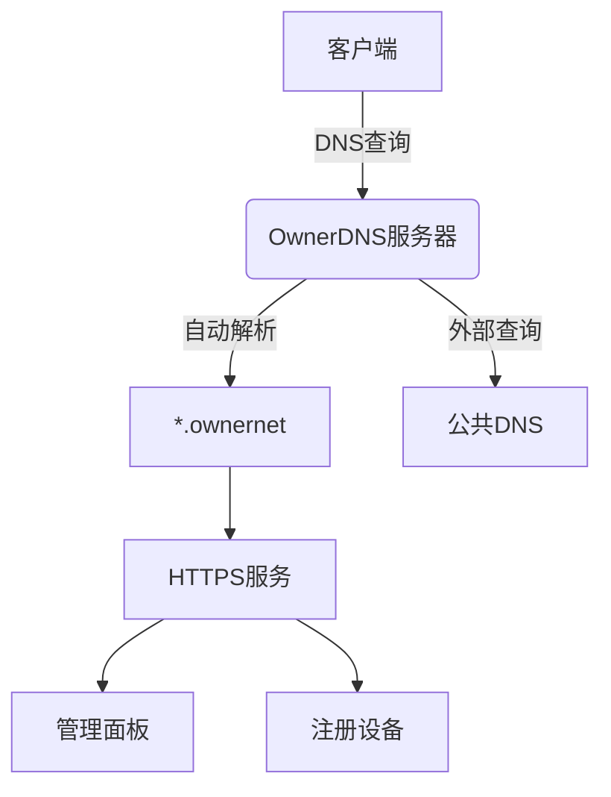

# OwnerDNS - 零配置私有网络解决方案

## 🌟 项目简介

OwnerDNS 是一个开箱即用的私有网络解决方案，提供：
- **自动DNS解析** - 所有 `.ownernet` 域名自动解析
- **一键式证书颁发** - 自签名CA自动管理
- **零配置客户端接入** - 设备连接网络即自动配置
- **精美管理面板** - 可视化网络管理界面

```bash
只需1条命令即可部署完整的私有网络基础设施！
```

## 🚀 快速开始

### 部署要求
- Ubuntu/Debian 服务器
- 静态IP地址（作为网关）
- 至少2GB内存

### 安装步骤
```bash
# 下载安装脚本
wget https://raw.githubusercontent.com/MakaZS/Ownerdns/main/ownerdns.sh

# 执行安装
sudo bash ownerdns.sh
```

### 网络拓扑
```
[客户端设备] ←(WiFi)→ [OwnerDNS服务器] ←(NAT)→ [互联网]
```

## ✨ 核心功能

| 功能 | 描述 | 示例 |
|------|------|------|
| 自动DNS | 解析所有`.ownernet`域名 | `ping mydevice.ownernet` |
| HTTPS支持 | 自动签发SSL证书 | `https://任意域名` |
| 管理面板 | 网页控制台 | `https://ownerweb.ownernet` |
| 设备注册 | 自助注册私有域名 | 注册`iot1.ownernet` |

## 📚 使用指南

### 1. 客户端连接
设备连接WiFi后：
1. 首次访问任意网站
2. 自动跳转证书安装页
3. 点击"一键安装"
4. 开始使用私有网络服务

### 2. 注册新设备
```bash
# 通过API注册
curl -X POST https://ownerweb.ownernet/register -d "domain=mydevice"

# 通过面板注册
访问 https://ownerweb.ownernet → 域名注册
```

### 3. 访问服务
```
https://[任意名称].ownernet → 指向注册设备
https://ownerweb.ownernet → 管理面板
```

## 🌍 网络架构



## 🛠️ 开发指南

### 项目结构
```
/opt/ownerdns/
├── ca/          # 证书颁发机构
├── api/         # 管理API服务
├── web/         # 网页控制台
└── config/      # 网络配置
```

### 修改配置
编辑 `/opt/ownerdns/config/settings.ini`:
```ini
[network]
domain_root = ownernet
server_ip = 192.168.1.1
```

## 📜 许可证

MIT License - 自由使用和修改

## 🤝 贡献指南

欢迎提交PR！建议贡献方向：
- 多平台证书安装脚本
- 更精美的管理界面
- 网络监控功能

---

> 📧 联系维护者: makaza@petalmail.com  
> 🌐 项目主页: https://github.com/MakaZS/Ownerdns
